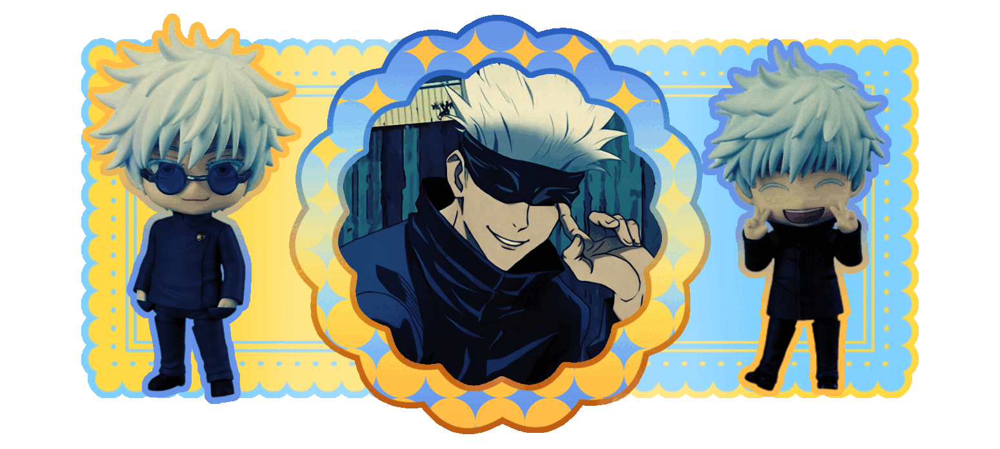

<pre>

 Hai! Feel free to int or sit with me! 😁
  
 <b>Likes</b> ✅: Anime, Games, and Drawing
 <b>Dislikes</b> ❌: Rude and Toxic People

 👾 Beginner Coder! Mostly HTML and Python 👾

 P.S. Dallae made my megumi and zhongli! Thank you btw for making them :>

   <a href="https://rentry.co/wambi"> <b>RENTRY</b> </a> || <a href="https://wambi.123guestbook.com/"> <b>GUESTBOOK</b> </a> || <a href="https://retrospring.net/@Wambi"> <b>RETROSPRING</b> </a> 
  

</pre>
  

Graphics by: hyp3rst4r & essthereal-archived

  

<!--
**wambibi/wambibi** is a ✨ _special_ ✨ repository because its `README.md` (this file) appears on your GitHub profile.

